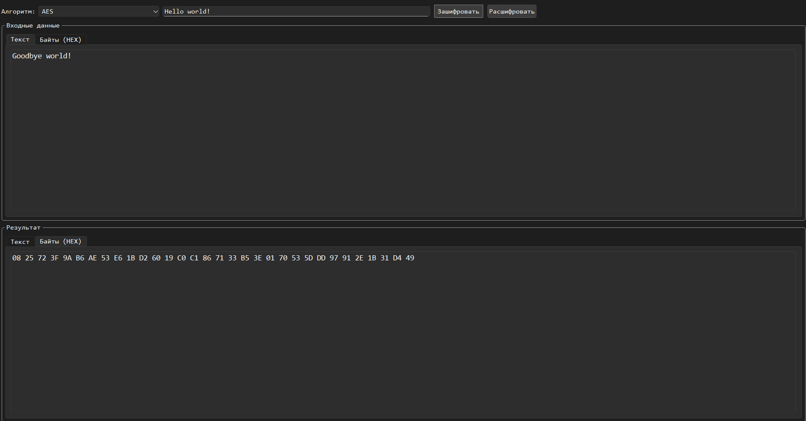

# DCrypt

DCrypt — это небольшая программа для шифрования и дешифрования текста.

# О программе

- Написано на C++ с использованием Qt6.
- Поддерживаемые алгоритмы:
  - Алфавитные шифры: Цезарь, Виженер, Гронсфельд, Вермана (одноразовый блокнот)
  - Симметричные шифры: AES, DES, DES-CBC, RC4
  - Асимметричный шифр: RSA
- Поддержка сборки через **CMake**.
- Поддерживается только на Windows

# Screenshots

